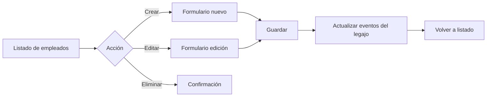

# Diagramas de Flujo – SJ Empleados

Este documento reúne diagramas de flujo (Mermaid) que describen los principales flujos del sistema: autenticación, empleados, asistencia, disciplinaria, recibos (payroll) y cuenta corriente.

## Visión General del Sistema

```mermaid
flowchart TD
  A[Login/Register] --> B{JWT válido?}
  B -- No --> A
  B -- Sí --> C[Dashboard]

  C --> D[Empleados]
  C --> E[Asistencia]
  C --> F[Disciplinaria]
  C --> G[Recibos de sueldo]
  C --> H[Cuenta corriente]

  %% Empleados
  D --> D1[Listar/Buscar]
  D --> D2[Crear/Editar/Eliminar]
  D2 --> D3[Eventos del legajo]

  %% Asistencia
  E --> E1[Registrar asistencia/tardanza]
  E1 --> E2[Calcular minutos de tardanza]
  E1 --> E3[Subir justificativo]
  E1 --> E4[Enviar WhatsApp]
  E --> E5[Listar/Filtrar/Ver documento]

  %% Disciplinaria
  F --> F1[Registrar medida]
  F1 --> F2[Subir documento]
  F1 --> F3[Calcular retorno (si suspensión)]
  F1 --> F4[Enviar WhatsApp]
  F --> F5[Listar/Filtrar]

  %% Payroll
  G --> G1[Crear/Editar recibo]
  G1 --> G2[Aplicar deducción semanal]
  G1 --> G3[Guardar y listar]
  G --> G4[Detalle del recibo]

  %% Cuenta corriente
  H --> H1[Seleccionar empleado]
  H --> H2[Ver saldo/transacciones]
  H --> H3[Actualizar deducción semanal]
  H --> H4[Registrar compra/pago]

  %% Integraciones
  subgraph Integraciones
    X[Cloudinary / Uploads]:::ext
    Y[Twilio WhatsApp]:::ext
    Z[MongoDB Atlas]:::ext
  end

  E3 --> X
  F2 --> X
  E4 --> Y
  F4 --> Y
  D & E & F & G & H --> Z

  classDef ext fill:#eef,stroke:#88a,stroke-width:1px,color:#223
```

## Flujo de Asistencia

```mermaid
flowchart LR
  A[Formulario de asistencia] --> B[Seleccionar empleado]
  B --> C[Completar fecha y tipo]
  C --> D{¿Tardanza?}
  D -- Sí --> E[Programada vs Real → minutos]
  D -- No --> F[Continuar]
  E --> G
  F --> G{¿Justificación/Certificado?}
  G -- Sí --> H[Subir archivo]
  G -- No --> I[Omitir]
  H --> J[Guardar URL (Cloudinary/local)]
  I --> J
  J --> K{¿Enviar WhatsApp?}
  K -- Sí --> L[Enviar vía Twilio]
  K -- No --> M[Omitir]
  L --> N[Crear registro]
  M --> N[Crear registro]
  N --> O[Listar/Filtrar]
  O --> P[Ver documento en modal]
```

## Flujo Disciplinaria

```mermaid
flowchart LR
  A[Formulario de disciplinaria] --> B[Seleccionar empleado]
  B --> C[Fecha/Hora/Tipo/Descripción]
  C --> D{¿Documento adjunto?}
  D -- Sí --> E[Subir archivo]
  D -- No --> F[Omitir]
  E --> G[Guardar URL (Cloudinary/local)]
  F --> G
  C --> H{¿Días de suspensión?}
  H -- Sí --> I[Calcular fecha de reincorporación]
  H -- No --> J[Sin cálculo]
  I --> K[Confirmar]
  J --> K
  K --> L[Guardar medida]
  L --> M{¿Enviar WhatsApp?}
  M -- Sí --> N[Enviar vía Twilio]
  M -- No --> O[Omitir]
  N --> P[Listado/Detalle]
  O --> P[Listado/Detalle]
```

## Flujo Payroll + Cuenta Corriente

```mermaid
flowchart TD
  A[Formulario de recibo] --> B[Seleccionar empleado]
  B --> C[Período y fecha de pago]
  C --> D[Presentismo/Horas extras/Otros/Descuentos]
  D --> E[Adelantos: solicitado/monto/fecha]
  E --> F[Importe neto base]
  F --> G[Aplicar deducción semanal (Cuenta)]
  G --> H[Calcular neto final]
  H --> I[Guardar recibo]
  I --> J[Listar recibos]
  J --> K[Detalle de recibo]

  subgraph Cuenta Corriente
    L[Seleccionar empleado]
    M[Ver saldo/transacciones]
    N[Actualizar deducción semanal]
    O[Registrar compra]
    P[Registrar pago]
  end

  N --> G
  O --> M
  P --> M
```

## Flujo Empleados



---

Sugerencia: Copia cualquier bloque Mermaid en https://mermaid.live para ver el diagrama renderizado, o abre este archivo en un visor compatible con Mermaid.